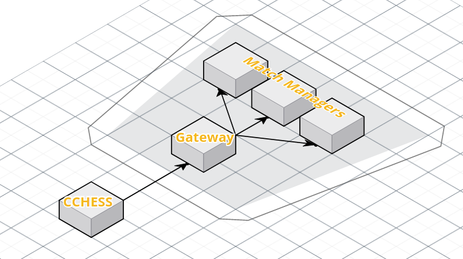

# CCHESS game
## A project of code guided k8s in a game environment

The plan is to run a gateway that serves a site, manages new players and redirects them to matches. Every match has a manager, which verifies plays and notifies players.

## Packages

There are mainly three packages in the project. The front-end, the gateway and the manager. One possible visualization is this one:

### Gateway

This project, that is responsible for welcoming new players.
It should be able to do this things:

- [x] Return the built site of front-end
- [ ] The front-end static must be a volume
- [ ] Creates a new container in manager's pod
- [ ] Redirects players to each container
- [ ] CRUD users
- [ ] Deal with cookies

### Front-end

The game per se, that players interact. Its responsibilites are:

- [x] Show home that makes request to gateway
- [ ] Users login
- [ ] Screen of matches
- [ ] The game

### Manager

The game manager, that deals with two players redirected by the gateway, it should:

- [x] Verify each play
- [ ] Assess the end of game

## 📝 License

Copyright © 2021 [Elvis Nobrega](https://github.com/elvismdnin). 
This project is [MIT](https://github.com/elvismdnin/main_color/blob/master/LICENSE) licensed.